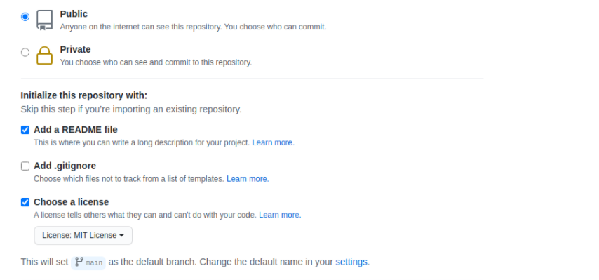

# **Kodluyoruzilkrepo**


Kodluyoruz Eğitimi kapsamında açtığım ilk repo
## Bu repo Kodluyoruz Front-End Eğitiminde oluşturduğumuz ilk repo. İçerisinde bir adet README dosyası, bir adet index.html barındırıyor.

## **Installation**
-------------------------


### Öncelikle projeyi clonelayın. (Buraya sizin reponuzdan aldığınız link gelecek)
``` git
git clone https://github.com/cengizcmataraci/kodluyoruzilkrepo.git
```
## **Usage**
---------------------------

Projeyi cloneladıktan sonra Visual Studio Code programında açınız.

Linux için:
``` git
cd kodluyoruzilkrepo
code .
```
## **Contributing**
-----------------------
Pull requestler kabul edilir. Büyük değişiklikler için, lütfen önce neyi değiştirmek istediğinizi tartışmak için bir konu açınız.
## **License**
[MIT](https://choosealicense.com/licenses/mit/)


